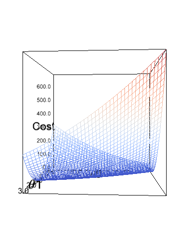
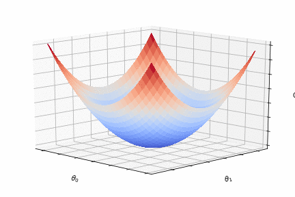
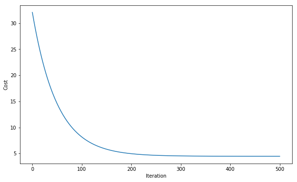
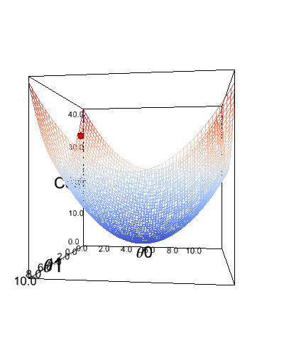
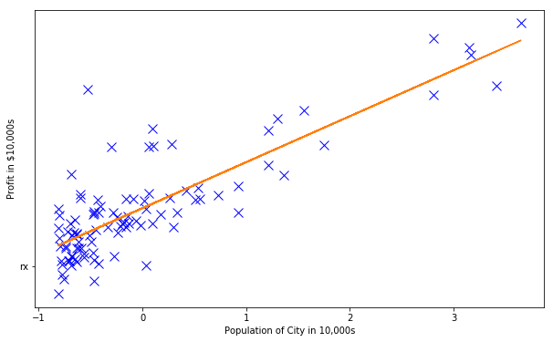

# Univariate Linear Regression

In linear regression we aim to find a hypothesis function, , that models a linear relationship between one or more explanatory variables, , ... , and a dependent varaible, .  can then be used to create predictions of  for unseen examples of , ..., .

## Importing packages


```python
import IPython.display
import base64
import pandas as pd
import matplotlib.pyplot as plt
import numpy as np
from matplotlib import animation
from mpl_toolkits.mplot3d import Axes3D
```

## Importing data


```python
data = pd.read_csv('./ex1data1.txt', header=None).values
x, y = data[:, :-1], data[:, -1:]
m = len(x)

print("x.shape is %s" % (x.shape,))
print("y.shape is %s" % (y.shape,))
```

    x.shape is (97, 1)
    y.shape is (97, 1)


## Plotting


```python
plt.figure(figsize=(10,6))
plt.plot(x, y, 'bx', 'rx',markersize=10)
plt.ylabel('Profit in y = mx + cmcyy = mx + cxyy = mx + cx_0, ..., x_nyh(x) = \theta_0 + \theta_1x_1 + \theta_2x_2 +, ..., \theta_nx_nx_01\theta_0\theta_0x_0\theta_0$')
    ax.set_ylabel(r'$\theta_1$')
    ax.set_zlabel('Cost')
    return fig,

frames = 180
rotation = 88
elevation = 30
elevation_offest = 15
rotation_offset = -45

def animate(i):
    # i >= 0, i <= frames
    elev = (np.sin(i / frames * 2 * np.pi + 3 / 2 * np.pi) + 1) / 2 * elevation + elevation_offest
    azim = np.sin(i / frames * 2 * np.pi) * (rotation / 2) + rotation_offset
    ax.view_init(elev=elev, azim=azim)
    return fig,

# Animate
ani = animation.FuncAnimation(fig, animate, init_func=init, frames=frames, interval=1, blit=True)
plt.close()
```


```python
ani.save('%s.gif' % 'cost', writer='imagemagick', fps=24)

with open('cost.gif', 'rb') as gif:
    url = b"data:image/gif;base64," +base64.b64encode(gif.read())
IPython.display.Image(url=url.decode('ascii'))
```



## Feature normalisation

To prevent  from oscilating during gradient descent, we normalise their range using z-score normalisation. This produces a uniform cost function that allows gradient descent to converge more quickly.


```python
# Remove x0 as we do not want to normalise it
x = x[:, 1:]

# Normalise x1, x2, ...
def feature_normalisation(x):
    mu = np.mean(x);
    sigma = np.std(x);
    return [(x - mu) / sigma, mu, sigma]

x, mu, sigma = feature_normalisation(x)

# Add x0
x = np.hstack((np.ones((m, 1)), x))
```

## Visualising the cost function after normalisation


```python
X = np.arange(5.83913505 - 6, 5.83913505 + 6,.2)
Y = np.arange(4.59304113 - 6, 4.59304113 + 6,.2)
X, Y = np.meshgrid(X, Y)
Z = np.zeros(X.shape)

for i in range(Z.shape[0]):
    for j in range(Z.shape[1]):
        Z[i][j] = half_mse(x, y, np.array([[X[i][j]], [Y[i][j]]]))
        
# Create a figure and a 3D Axes
fig = plt.figure()
ax = Axes3D(fig)

# Plot the surface.
ax.plot_surface(X, Y, Z, cmap="coolwarm", linewidth=0, antialiased=False)

def init():
    ax.set_xticklabels([])
    ax.set_yticklabels([])
    ax.set_zticklabels([])
    ax.set_xlabel(r'$\theta_0$')
    ax.set_ylabel(r'$\theta_1$')
    ax.set_zlabel('Cost')
    return fig,

frames = 180
rotation = 88
elevation = 45
elevation_offest = 15
rotation_offset = -45

def animate(i):
    # i >= 0, i <= frames
    elev = (np.sin(i / frames * 2 * np.pi + 3 / 2 * np.pi) + 1) / 2 * elevation + elevation_offest
    azim = np.sin(i / frames * 2 * np.pi) * (rotation / 2) + rotation_offset
    
    ax.view_init(elev=elev, azim=azim)
    return fig,

# Animate
ani = animation.FuncAnimation(fig, animate, init_func=init, frames=frames, interval=1, blit=True)
plt.close()
```


```python
ani.save('%s.gif' % 'normalised_cost', writer='imagemagick', fps=24)

with open('normalised_cost.gif', 'rb') as gif:
    url = b"data:image/gif;base64," +base64.b64encode(gif.read())
IPython.display.Image(url=url.decode('ascii'))
```



## Gradient Descent

There are several methods of finding the optimal value of each coefficient , but two common methods are gradient descent and analytical analysis via normal equations.

The key difference between the two methods is their algrithmic complexity. Gradient descent has a complexity of  while normal equations has a complexity of , where  is the number of explanatory variables, . This makes gradient descent more suitable for problems involving over  explanatory variables.


```python
def gradient_descent(x, y, theta, alpha, iterations):
    history = []
    history.append(theta)
    for i in range(iterations):
        theta = theta - alpha / m * x.T @ (x @ theta - y)
        history.append(theta)
    return history
```


```python
# Initialise theta0, theta1, ...
theta = np.zeros((x.shape[1], 1));

# Set the parameters of gradient descent
iterations = 500
alpha = 0.01

# Run gradient descent
history = gradient_descent(x, y, theta, alpha, iterations)
theta = history[-1]

for i, t in enumerate(theta.squeeze()):
    print("Theta%s = %s" % (i, t))
```

    Theta0 = 5.800769113707832
    Theta1 = 4.562862634482999


## Plotting the cost of  during gradient descent


```python
history = np.array(history).squeeze()
Z = np.array([half_mse(x, y, np.array([[u], [v]])) for u, v in zip(history[:, 0], history[:, 1])])
plt.figure(figsize=(10,6))
plt.plot(Z, '-',markersize=10)
plt.ylabel('Cost')
plt.xlabel('Iteration')
plt.show()
```





## Visualising gradient descent


```python
X = np.arange(5.83913505 - 6, 5.83913505 + 6,.2)
Y = np.arange(4.59304113 - 6, 4.59304113 + 6,.2)
X, Y = np.meshgrid(X, Y)
Z = np.zeros(X.shape)

for i in range(Z.shape[0]):
    for j in range(Z.shape[1]):
        Z[i][j] = half_mse(x, y, np.array([[X[i][j]], [Y[i][j]]]))
        
W = history[:, 0]
U = history[:, 1]
V = np.array([half_mse(x, y, np.array([[w], [u]])) for w, u in zip(W, U)])
        
# Create a figure and a 3D Axes
fig = plt.figure()
ax = Axes3D(fig)

ax.plot_surface(X, Y, Z, cmap="coolwarm", zorder=-100)
line, = ax.plot(W, U, V, '-r', linewidth=5, zorder=100)

def init():
    line.set_data([], [])
    line.set_3d_properties([])
    ax.set_xticklabels([])
    ax.set_yticklabels([])
    ax.set_zticklabels([])
    ax.set_xlabel(r'$\theta_0$')
    ax.set_ylabel(r'$\theta_1$')
    ax.set_zlabel('Cost')
    return fig,

frames = 180
rotation = 88
elevation = 45
elevation_offest = 15
rotation_offset = -45

def animate(i):
    # i >= 0, i <= frames
    elev = (np.sin(i / frames * 2 * np.pi + 3 / 2 * np.pi) + 1) / 2 * elevation + elevation_offest
    azim = np.sin(i / frames * 2 * np.pi) * (rotation / 2) + rotation_offset
    ax.view_init(elev=elev, azim=azim)

    line.set_data(W[:round(i/frames * 500)], U[:round(i/frames * 500)])
    line.set_3d_properties(V[:round(i/frames * 500)])
    return fig,

# Animate
ani = animation.FuncAnimation(fig, animate, init_func=init, frames=frames, interval=1, blit=True)
plt.close()
```


```python
ani.save('%s.gif' % 'gradient_descent', writer='imagemagick', fps=24)

with open('gradient_descent.gif', 'rb') as gif:
    url = b"data:image/gif;base64," +base64.b64encode(gif.read())
IPython.display.Image(url=url.decode('ascii'))
```



## Plotting the hypothesis function


```python
plt.figure(figsize=(10,6))
plt.plot(x[:, 1], y, 'bx', 'rx',markersize=10)
plt.plot(x[:, 1], x @ theta, '-')
plt.ylabel('Profit in $10,000s')
plt.xlabel('Population of City in 10,000s')
plt.show()
```





# Multivariate Linear Regression


```python
data = pd.read_csv('./ex1data2.txt', header=None).values
x, y = data[:, :-1], data[:, -1:]
m = len(x)

print("x.shape is %s" % (x.shape,))
print("y.shape is %s" % (y.shape,))
```

## Plotting


```python
fig = ipv.figure()
s = ipv.scatter(x[:, 0].astype(float), y.squeeze().astype(float), x[:, 1].astype(float), marker='sphere', size=5)
ipv.show()
```


```python
x = np.linspace(0, 360, 360)
y = np.sin(x / 360 * 2 * np.pi) * 45
z = (np.sin(x / 360 * 2 * np.pi + 3 / 2 * np.pi ) + 1) / 2 * 45

plt.plot(x, y, label='Rotation')
plt.plot(x, z, label='Elevatin')
plt.legend()
plt.show()
```


```python

```
