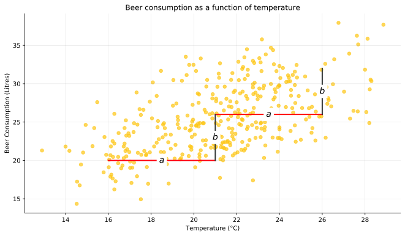
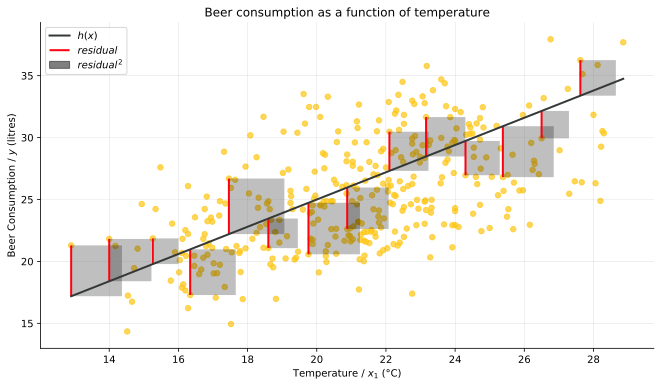

# Intuative ML

Machine learning methods implemented in Python3 using Jupyter Notebooks with intuative explanations and well commented code.

## Table of Contents
[Simple Linear Regression](simple_linear_regression#Introduction) 

  
  

