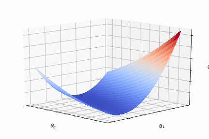

# Machine learning from the ground up

Machine learning methods implemented in NumPy with simple, clear explanations and well commented code.

## Table of Contents

## Acknowledgments

Inspired by [ml-from-scratch](https://github.com/eriklindernoren/ML-From-Scratch).

